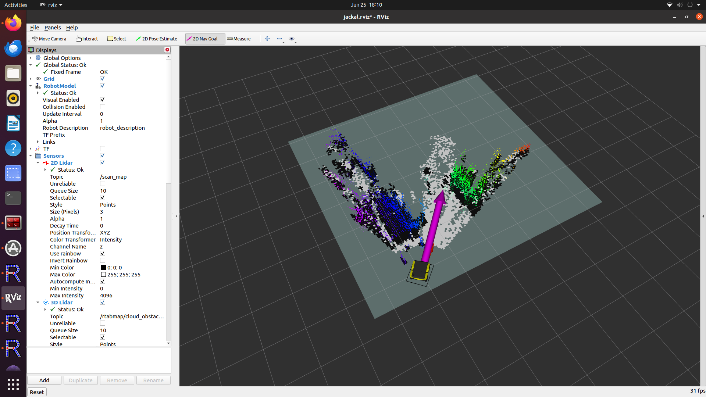

# Jackal SLAM & Navigation Workspace

## 🌐 Remote Access to Jackal from Another PC
To visualize the SLAM process remotely (without having the Jackal tethered to a screen), it is possible to connect to the Jackal's onboard PC (running Ubuntu + ROS) using another computer via SSH with X11 forwarding.

**Steps:**
1. Ensure both the Jackal and your PC are connected to the same Wi-Fi network.
2. In your terminal on your PC, run:
   ```bash
   ssh -X -C administrator@<Jackal_IP_address>
   ```
   Example (at Hub&Go):
   ```bash
   ssh -X -C administrator@10.170.36.70
   ```
3. Enter the password: clearpath.
4. Now, all ROS commands and RViz visualizations can be run from your PC, displayed as if they were local.


## 🚗 Physical Cabling & Setup

### Required connections:
| Device                             | Connection Description                                 |
|------------------------------------|--------------------------------------------------------|
| Robosense                          | Direct Ethernet (no switch needed)                    |
| RPlidar                            | USB                                                   |
| Intel RealSense D415 Camera       | USB 3.0 to onboard PC                                 |
| USB Multiport Adapter              | Plugged into onboard PC, connects mouse, keyboard, controller |
| Mini USB → MCU                     | For MCU communication with the PC                     |

---

<div align="center">
  
  <p><i>Overview of physical connections on the Jackal robot</i></p>
</div>

## 📊 Interface Monitoring (IHM)

Before starting the system, ensure the following indicators are in proper state:

- 🔘 **M Icon**: ON → Motors are active (toggle with the M button)
- 🔁 **Two Arrows**: ON → Communication between onboard PC and MCU is established
- 📶 **WiFi Icon**: ON → Jackal is connected to the local wireless network
- 🔋 **Battery Indicator**: GREEN (static) → Battery level is sufficient
- 🔵 **Power Button**: BLUE (static) → Jackal is powered ON

---

<div align="center">
  
  <p><i>Status panel showing correct system readiness</i></p>
</div>


## 💻 ROS Environment Setup

### 1. System Preparation:
```bash
sudo apt update && sudo apt upgrade
```
### 2. Required ROS Packages:
Make sure these packages are installed:

- `jackal_desktop`
- `rplidar_ros`
- `realsense2_camera`
- `robosense_ros`
- `rtabmap_ros`
- `teleop_twist_joy` and `teleop_twist_keyboard`

Check if a package is installed:
```bash
rospack list | grep <name_package>
```

> Ensure your ~/.bashrc sources the correct ROS workspace and environment.


## 🎮 Manual Control with Controller & Keyboard

### 🕹️ Gamepad (Logitech F710):
- Plug the USB adapter into the USB hub on the Jackal.
- Ensure:
  - **LED MODE** is off.
  - The top switch is set to `D` mode.

### Gamepad Usage:
- Press the left analog stick (L3).
- Use L2 + left analog to control the robot's motion.

---

<div align="center">
  
  <p><i>Logitech F710 setup guide: switch to 'D' and ensure LED MODE is off</i></p>
</div>


#### Start Teleop:
```bash
roslaunch teleop_twist_joy teleop.launch joy_dev:=/dev/input/f710
```
> Try also with `js0` or `js1` depending on the detected input port.

### Check input signal:
```bash
cat /dev/input/f710
```
### Verify ROS graph:
- Run rqt_graph
- Make sure the /teleop_twist_joy node is publishing to /cmd_vel.

---

<div align="center"> 
    
   <p><i>ROS graph: <code>/teleop_twist_joy</code> publishing to <code>/cmd_vel</code></i></p> 
</div>

### ⌨️ Keyboard:
Open a new terminal and run:
```bash
rosrun teleop_twist_keyboard teleop_twist_keyboard.py
```
Controls:
- `U` `I` `O` → Move forward while turning left / straight / turning right.
- `J` `K` `L` → Rotate counterclockwise / stop / rotate clockwise.
- `M` `<` `>` → Move backward while turning left / straight / turning right.

## 🔄 Launch Sequence for SLAM Visualization in RViz:
> 💡**Recommended:** Install `terminator` for easier multi-terminal management:
```bash
sudo apt-get install terminator
```

### Step-by-step:
1. Start Jackal SLAM stack:
   ```bash
   roslaunch my_rtab_map start_rtabmap_working_jackal.launch
   ```
2. Start RViz with SLAM view:
   ```bash
   roslaunch my_rtab_map start_rtabmap_working_jackal.launch
   ```
3. Launch Intel RealSense camera:
   ```bash
   roslaunch my_rtab_map start_rtabmap_working_D415_RGBD.launch
   ```

---

<div align="center"> 
    
   <p><i>RViz displaying SLAM results with Intel RealSense and RTAB-Map</i></p> 
</div>

## 🖥️ RViz Displays Configuration
To properly visualize SLAM data in RViz, make sure the following topics are set in the **Displays** panel:

### 📡 Sensors
- **2D Lidar**  
  → Topic: `/scan_map`
- **3D PointCloud (Robosense)**
  → Topic: `/rtabmap/cloud_map`

### 🗺️ Map
- **Projected Map (Explored Space)**  
  - Topic >  `/rtabmap/proj_map`


---

<div align="center">
  
  <p><i>Displays panel in RViz showing correct topic configuration</i></p>
</div>


## 🎯 Result: Real-Time 2D & 3D SLAM Visualization
After launching all the components, you should now see your robot actively exploring the environment in **real time** on **RViz**, with both:

- 🟢 **2D Lidar map**  
- 🔵 **3D PointCloud map** from Robosense and RealSense

> 🧭 This live mapping allows you to monitor the SLAM performance and verify correct sensor fusion.

<div align="center">
  
  <p><i>Live exploration using 2D Lidar + 3D SLAM with Robosense & RealSense</i></p>
</div>

## 🌍 Navigation Goal (2D Nav Goal Command)

Once the SLAM environment is launched, you can send autonomous goals to the robot via RViz using the **2D Nav Goal** tool.

### 🚀 Launch the navigation demo:
Open a new terminal:
   ```bash
   roslaunch jackal_navigation odom_navigation_demo.launch
   ```
### 🖱️ Send a goal in RViz:
- Use the *2D Nav Goal* button (top toolbar in RViz).
- Click anywhere on the map and drag to indicate the direction the robot should face.
- Jackal will autonomously compute a path and navigate toward the goal.

### 📍 Monitor the goal position:
```bash
rostopic echo /move_base_simple/goal
```
You’ll see the coordinates of each goal you send!

<div align="center">

<table>
  <tr>
    <td align="center">
      
      <p><i>Autonomous navigation using 2D Nav Goal in RViz</i></p>
    </td>
    <td align="center">
      
      <p><i>Click and drag to set orientation of the goal</i></p>
    </td>
  </tr>
</table>

</div>


## 📄 License & Author
> Author: Adham ALI
> 
> License: `MIT License`
> 
This repository is open-source under the terms of the MIT License. You are free to use, modify, and distribute this software. See the LICENSE file for more information.
