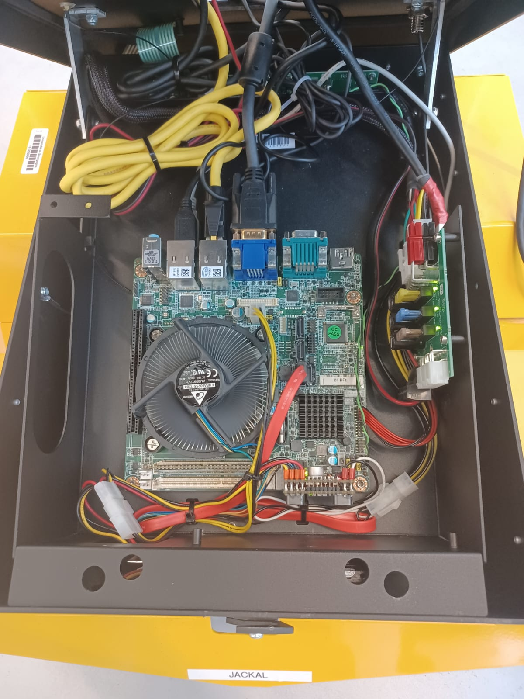
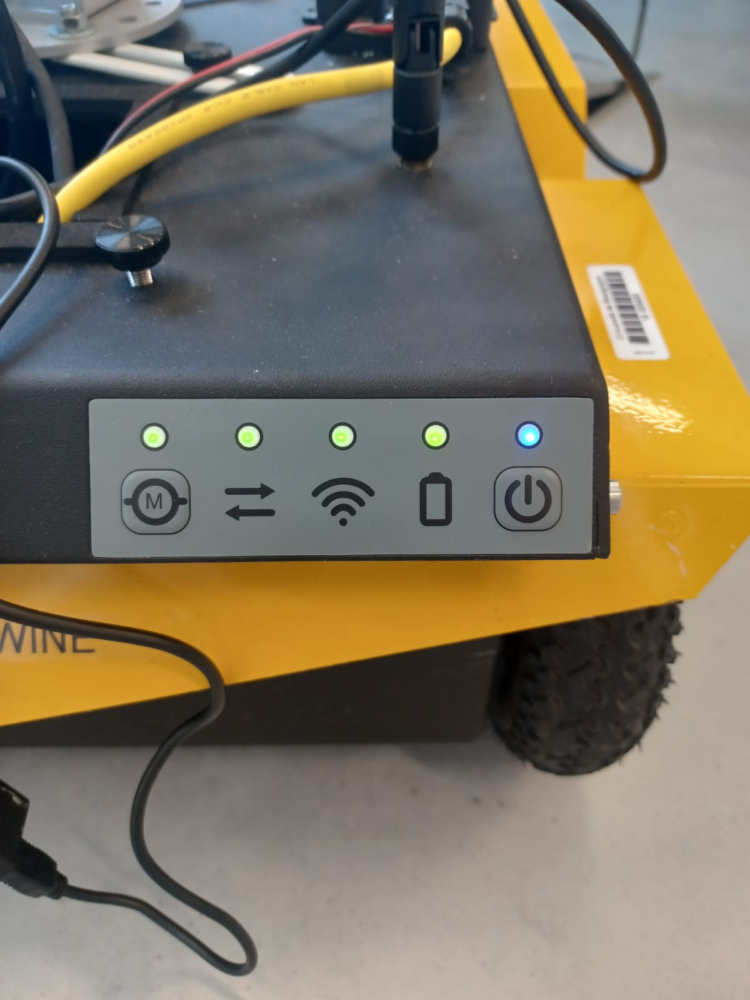
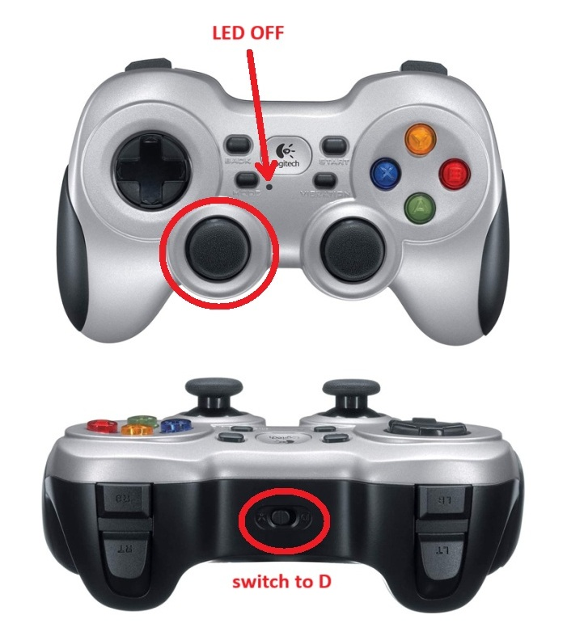
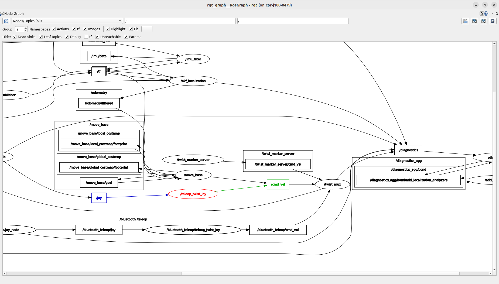
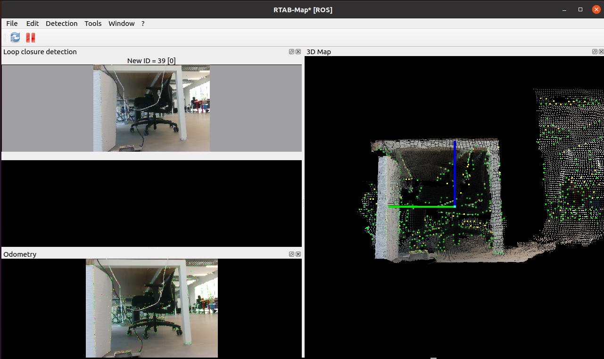
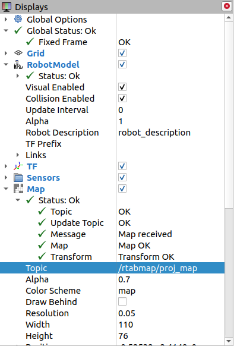

# Jackal SLAM & Navigation Workspace

## 🌐 Remote Access to Jackal from Another PC
To visualize the SLAM process remotely (without having the Jackal tethered to a screen), it is possible to connect to the Jackal's onboard PC (running Ubuntu + ROS) using another computer via SSH with X11 forwarding.

**Steps:**
1. Ensure both the Jackal and your PC are connected to the same Wi-Fi network.
2. In your terminal on your PC, run:
   ```bash
   ssh -X -C administrator@<Jackal_IP_address>
   ```
   Example (at Hub&Go):
   ```bash
   ssh -X -C administrator@10.170.36.70
   ```
3. Enter the password: clearpath.
4. Now, all ROS commands and RViz visualizations can be run from your PC, displayed as if they were local.


## 🚗 Physical Cabling & Setup

### Required connections:
| Device                             | Connection Description                                 |
|------------------------------------|--------------------------------------------------------|
| Robosense                          | Direct Ethernet (no switch needed)                    |
| RPlidar                            | USB                                                   |
| Intel RealSense D415 Camera       | USB 3.0 to onboard PC                                 |
| USB Multiport Adapter              | Plugged into onboard PC, connects mouse, keyboard, controller |
| Mini USB → MCU                     | For MCU communication with the PC                     |

> 


## 📊 Interface Monitoring (IHM)

Before starting the system, ensure the following indicators are in proper state:

- **M Icon**: ON → Motors are active (toggle with the M button)
- **Two Arrows**: ON → Communication between onboard PC and MCU is established
- **WiFi Icon**: ON → Jackal is connected to the local wireless network
- **Battery Indicator**: GREEN (static) → Battery level is sufficient
- **Power Button**: BLUE (static) → Jackal is powered ON

> 


## 💻 ROS Environment Setup

### 1. System Preparation:
```bash
sudo apt update && sudo apt upgrade
```
### 2. Required ROS Packages:
Make sure these packages are installed:

- jackal_desktop
- rplidar_ros
- realsense2_camera
- robosense_ros
- rtabmap_ros
- teleop_twist_joy and teleop_twist_keyboard

> Ensure your ~/.bashrc sources the correct ROS workspace and environment.


## 🎮 Manual Control with Controller & Keyboard

### Gamepad (Logitech F710):
- Plug the USB adapter into the USB hub on the Jackal.
- Ensure:
  - **LED MODE** is off.
  - The top switch is set to `D` mode.

### Gamepad Usage:
- Press the left analog stick (L3).
- Use L2 + left analog to control the robot's motion.

> 

#### Start Teleop:
```bash
roslaunch teleop_twist_joy teleop.launch joy_dev:=/dev/input/f710
```
> Try also with `js0` or `js1` depending on the detected input port.

### Check input signal:
```bash
cat /dev/input/f710
```
### Verify ROS graph:
- Run rqt_graph
- Make sure the /teleop_twist_joy node is publishing to /cmd_vel.

> 

### Keyboard:
Open a new terminal and run:
```bash
rosrun teleop_twist_keyboard teleop_twist_keyboard.py
```
Controls:
- `U` `I` `O` → Move forward while turning left / straight / turning right.
- `J` `K` `L` → Rotate counterclockwise / stop / rotate clockwise.
- `M` `<` `>` → Move backward while turning left / straight / turning right.


## 🔄 Launch Sequence for SLAM Visualization in RViz:
> Recommended: Install `terminator` for easier multi-terminal management:
```bash
sudo apt-get install terminator
```

### Step-by-step:
1. Start Jackal SLAM stack:
   ```bash
   roslaunch my_rtab_map start_rtabmap_working_jackal.launch
   ```
2. Start RViz with SLAM view:
   ```bash
   roslaunch my_rtab_map start_rtabmap_working_jackal.launch
   ```
3. Launch Intel RealSense camera:
   ```bash
   roslaunch my_rtab_map start_rtabmap_working_D415_RGBD.launch
   ```
> 

## Displays:
- Sensors
  - 2D Lidar: Topic > `/scan_map`
  - 3D PointCloud (Robosense): Topic > `/rtabmap/cloud_map`
- Map
  - Topic >  `/rtabmap/proj_map`

> 

---

> ### Result:
> You can now see the robot exploring your room in real time on Rviz!
>
> 

## 🌍 Navigation Goal (2D Nav Goal Command)
1. Open a new terminal:
   ```bash
   roslaunch jackal_navigation odom_navigation_demo.launch
   ```
2. On RViz, use the "2D Nav Goal" tool to click and set a destination for the robot.
3. To monitor target coordinates sent:
   ```bash
   rostopic echo /move_base_simple/goal
   ```
> 

## 📄 License & Author
> Author: Adham ALI
> 
> License: `MIT License`
> 
This repository is open-source under the terms of the MIT License. You are free to use, modify, and distribute this software. See the LICENSE file for more information.
